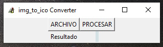
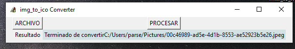

# Create with Python
A simple converter for Windows, executable.

Note: 

-This is an executable file on Windows

-The language is spanish because the client requested it.

-The client did not request it, that is why the program does not present any noticeable visual style.
